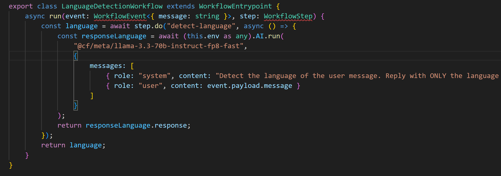

Optional Assignment: See instructions below for Cloudflare AI app assignment. SUBMIT GitHub repo URL for the AI project here. (Please do not submit irrelevant repositories.)
Optional Assignment Instructions: We plan to fast track review of candidates who complete an assignment to build a type of __AI-powered application__ on Cloudflare. An AI-powered application should include the following components:
* LLM (recommend using Llama 3.3 on Workers AI), or an external LLM of your choice
* Workflow / coordination (recommend using Workflows, Workers or Durable Objects)
* User input via chat or voice (recommend using Pages or Realtime)
* Memory or state
Find additional documentation __here__.
 
__IMPORTANT NOTE:__ To be considered, your repository name must be prefixed with cf_ai_, must include a README.md file with project documentation and clear running instructions to try out components (either locally or via deployed link). AI-assisted coding is encouraged, but you must include AI prompts used in PROMPTS.md
 
All work must be original; copying from other submissions is strictly prohibited.

explica me resumidamente este projeto que é para fazer para uma candidatura a summer internship para a cloudflare.
consulta os dois links fornecidos para perceberes melhor se necessário
se percisares de mais infos diz

eu gostava que me ajudasses a fazer isso
esta é a pagina que aparece abrindo um dos links , o outro é uma especie de guia
como devo começar

https://developers.cloudflare.com/workers/wrangler/configuration/
consulta este link para configurar o wrangler resume e diz me o que é importante para este projeto

o que é um worker e um durable object

esta é a classe index, explica me como interpretar isto, como começar e como testar

PS C:\Users\James\Desktop\cf_ai_research_agent> npm run dev
> cf-ai-research-agent@0.0.0 dev
> wrangler dev
 ⛅️ wrangler 4.73.0
───────────────────
Cloudflare collects anonymous telemetry about your usage of Wrangler. Learn more at https://github.com/cloudflare/workers-sdk/tree/main/packages/wrangler/telemetry.md
Your Worker has access to the following bindings:
Binding                                 Resource            Mode
env.RESEARCH_AGENT (ResearchAgent)      Durable Object      local
env.AI                                  AI                  remote
❓ Your types might be out of date. Re-run wrangler types to ensure your types are correct.
╭──────────────────────────────────────────────────────────────────────╮
│  [b] open a browser [d] open devtools [c] clear console [x] to exit  │
╰──────────────────────────────────────────────────────────────────────╯
X [ERROR] Your Worker depends on the following Durable Objects, which are not exported in your entrypoint file: ResearchAgent.
  You should export these objects from your entrypoint, src\index.ts.
🪵  Logs were written to "C:\Users\James\AppData\Roaming\xdg.config\.wrangler\logs\wrangler-2026-03- 15_20-23-35_618.log"
Assertion failed: !(handle->flags & UV_HANDLE_CLOSING), file src\win\async.c, line 76

Property 'RESEARCH_AGENT' does not exist on type 'Env'.ts(2339)

        const stub = env.RESEARCH_AGENT.get<ResearchAgent>(id);
Expected 0 type arguments, but got 1.ts(2558)

        const greeting = await stub.sayHello("world");
Property 'sayHello' does not exist on type 'DurableObjectStub<undefined>'.ts(2339)

sem me dares a resposta ajuda me a ter ideia como fazer o proximo passo

devemos guardar as perguntas anteriores guardando o string talvez associado ao id do stub da conversa? o que é o env?

o construtor recebe o env e o durable object

o metodo chat deve aceder à lista (historico) e "enviar" para o llm, depois recebe a resposta do llm

guarda-la no historico

async chat(mensagem): 
adicionar { role: "user", content: mensagem } à lista 
enviar this.messages para this.env.AI
receber resposta do this.env.AI
adicionar role: ai, content mensagem a lista

apos declarar a lista de mensagenso que devo fazer

como faço para receber a resposta da LLM

o que significa          "@cf/meta/llama-3.3-70b-instruct-fp8-fast",

para receber a mensagem do user tem de ter acesso a lista messages?

o worker recebe o durable object? recebe do durable object? estou confuso
como assim que pedido do frontend?

request: Request<unknown, IncomingRequestCfProperties<unknown>>

if(request.method == "POST" &&  url.pathname == "/chat")

if(request.method == "POST" &&  url.pathname == "/chat"){ 
const rep = await stub.chat(body.message);
 }

if(request.method == "POST" &&  url.pathname == "/chat"){  
const rep = await stub.chat(body.message); 

}
return response.json({reply});

if (request.method === "POST" && url.pathname === "/chat") {
 const body = await request.json() as { message: string };
 const reply = await stub.chat(body.message); 
return Response.json({ reply });
 }

 PS C:\Users\James\Desktop\cf_ai_research_agent> curl -X POST http://localhost:8787/chat -H "Content-Type: application/json" -d "{\"message\": \"O que e a internet?\"}"

Invoke-WebRequest : Cannot bind parameter 'Headers'. Cannot convert the "Content-Type: application/json" value of type 

"System.String" to type "System.Collections.IDictionary".

At line:1 char:44

+ ... ttp://localhost:8787/chat -H "Content-Type: application/json" -d "{\" ...

+                                  ~~~~~~~~~~~~~~~~~~~~~~~~~~~~~~~~

    + CategoryInfo          : InvalidArgument: (:) [Invoke-WebRequest], ParameterBindingException

    + FullyQualifiedErrorId : CannotConvertArgumentNoMessage,Microsoft.PowerShell.Commands.InvokeWebRequestCommand

 PS C:\Users\James\Desktop\cf_ai_research_agent> Invoke-WebRequest -Uri "http://localhost:8787/chat" -Method POST -ContentType "application/json" -Body '{"message": "O que e a internet?"}'
>>
StatusCode        : 200
StatusDescription : OK
Content           : {"reply":"A internet é um sistema global de redes de computadores interconectadas que utilizam o protocolo de   
                    comunicação TCP/IP (Transmission Control Protocol/Internet Protocol) para se comunicar ...
RawContent        : HTTP/1.1 200 OK
                    Content-Length: 1142
                    Content-Type: application/json
                    {"reply":"A internet é um sistema global de redes de computadores interconectadas que utilizam o protocolo de   
                    comunicação TC...
Forms             : {}
Headers           : {[Content-Length, 1142], [Content-Type, application/json]}
Images            : {}
InputFields       : {}
Links             : {}
ParsedHtml        : mshtml.HTMLDocumentClass
RawContentLength  : 1142

apareceu me isto no terminal mas nao no localhost

por onde achas que devo começar o frontend

<body>
    <div id="messages">
    </div>

    <div id="input-area">
        <input type="text" id="..." placeholder="write your question">
        <button id="...">send</button>
    </div>
</body>

o que falta

<!DOCTYPE html>
<html lang="en">
    <head>
        <meta charset="UTF-8" />
        <meta name="viewport" content="width=device-width, initial-scale=1.0" />
        <title>Hello, World!</title>
    </head>
    <body>
    <div id="messages">
    </div>

    <div id="input-area">
        <input type="text" id="user-input" placeholder="write your question">
        <button id="send-button">send</button>
    </div>
</body>
</html>
ajuda me com javascript, nao tenho conhecimento dessa linguagem

o javascript tem de receber a variavel "user-input" que é a pergunta do utilizador, encontra o botão e o input dessa mesma forma, atraves da variavel

<script>
        const button = document.getElementById("send-button");
        const input = document.getElementById("user-input");
        const messages = document.getElementById("messages");
    </script>

quando o user enviar algo a variavel "user-input" fica preenchida, quando clicar no botao send, o event listener é ativo, dentro do listener teremos de receber a varaivel input e envia la ao worker  

explica me linha a linha o passo 2

envia la de volta para o user, isto é tem de aparecer no ecrã na caixa de texto que declarámos para esse efeito

estou baralhado, onde metemos const data = await response.json(); ? 
e isto? const p = document.createElement("p"); p.textContent = data.reply; messages.appendChild(p);

vai criar um elemento na pagina, neste caso um text content com a resposta da llm
```html
<!DOCTYPE html>
<html lang="en">
	<head>
		<meta charset="UTF-8" />
		<meta name="viewport" content="width=device-width, initial-scale=1.0" />
		<title>Hello, World!</title>
	</head>
	<body>
    <div id="messages">
    </div>

    <div id="input-area">
        <input type="text" id="user-input" placeholder="write your question">
        <button id="send-button">send</button>
    </div>
	<script>
		const button = document.getElementById("send-button");
		const input = document.getElementById("user-input");
		const messages = document.getElementById("messages");

		button.addEventListener("click", async () => {
			const message = input.value;
			const response = await fetch("/chat", {
    			
				method: "POST",
    			headers: { "Content-Type": "application/json" },
    			body: JSON.stringify({ message: message })
			});
		    const data = await response.json();
			const p = document.createElement("p");
    		p.textContent = data.reply;
    		messages.appendChild(p);
		});
	</script>
</body>
	
</html>

```

o que achas?

responde corretamente as perguntas o que é bom

mas há 2 problemas:
eu fiz 3 perguntas "quanto é 2+2" "quanto é 2+3" "quais foram as 2 ultimas perguntas que eu fiz"
apesar de ter respondido bem, ele nao memorizou, isto é, ele na ultima disse que eu nunca tinha feito perguntas

outro problema é que, apesar de mostrar as respostas todas, (a 1a a 2a e 3a) as pergunta snao paarecem, ficando com aquele formato

```html
button.addEventListener("click", async () => {
			
			const message = input.value;
			
			const userInput = document.createElement("b");
			userInput.textContent = message;
			messages.appendChild(userInput);			
			
			const response = await fetch("/chat", {
    			
				method: "POST",
    			headers: { "Content-Type": "application/json" },
    			body: JSON.stringify({ message: message })
			});
		    const data = await response.json();
			const p = document.createElement("p");
    		p.textContent = data.reply;
    		messages.appendChild(p);
		});
```

ao que parece ele afinal tem memoria, a bocado devo ter percebido mal, o que é que ainda falta fazer de acordo com o enunciado

a brave search api é completamente gratis e usavel em qualquer pc em que este codigo seja testado?
é preciso o agente ter memoria em caso de reinicio do server?

 que mais opcoes do requisito de workflow podemos fazer sem que ninguem precise de instalar ou criar contas, apenas com o codigo

 PS C:\Users\James\Desktop\cf_ai_research_agent> npm install cloudflare:workers
npm error code EUNSUPPORTEDPROTOCOL
npm error Unsupported URL Type "cloudflare:": cloudflare:workers
npm error A complete log of this run can be found in: C:\Users\James\AppData\Local\npm-cache\_logs\2026-03-18T13_35_17_810Z-debug-0.log

o que achas de para workflow input -> deteta a linguagem e, ao lado do input do user aparece uma tag com o idioma -> resposta da llm?

como devo começar?

 sem me dares a resposta, diz me como continuar

export class ResearchAgent extends DurableObject {

tenho de fazer igual mas para a language detection? ou aproveito

export class LanguageDetectionWorkflow extends WorkflowEntrypoint {

export class ResearchAgent extends DurableObject {
a ordem é indiferente?

o objetivo é run (language detection) sempre que receber uma mensagem

run precisa de receber a mensagem do user

```typescript
export class LanguageDetectionWorkflow extends WorkflowEntrypoint {
	async run(event: WorkflowEvent<{ message: string }>, step: WorkflowStep) {

		const language = await step.do("detect-language", async () => {

			const responseLanguage = await (this.env as any).AI.run(
        	"@cf/meta/llama-3.3-70b-instruct-fp8-fast",

    	return language; 
	});
```

eu sei que nao está certo mas como devo prosseguir

export class LanguageDetectionWorkflow extends WorkflowEntrypoint {
		async run(event: WorkflowEvent<{ message: string }>, step: WorkflowStep) {

			const language = await step.do("detect-language", async () => {

				const responseLanguage = await (this.env as any).AI.run(
				"@cf/meta/llama-3.3-70b-instruct-fp8-fast",
			{
        		messages: [
            		{ role: "system", content: "Detect the language of the user message. Reply with ONLY the language name, nothing else. For example: 'Portuguese' or 'English'." },
            		{ role: "user", content: event.payload.message }
        		]
    		}

			return responseLanguage.language; 
		});
        
    }

     porque tem erros ali

    if (request.method === "POST" && url.pathname === "/chat") {
 		const body = await request.json() as { message: string }; //verifies if the request is "post" and extracts the message and passes it to the durable object
 		const instance = await env.LANGUAGE_WORKFLOW.create({
    		params: { message: body.message }
		});
		const result = await instance.waitForTermination();
		const language = result.output as string;
		const reply = await stub.chat(body.message); 
		return Response.json({ reply });
 		}
		return new Response("Not found", { status: 404 });

estou baralhado, consegues explicar melhor

		const result = await instance.waitForTermination();
erro no waitfortermination

sim

<!DOCTYPE html>
<html lang="en">
    <head>
        <meta charset="UTF-8" />
        <meta name="viewport" content="width=device-width, initial-scale=1.0" />
        <title>Hello, World!</title>
    </head>
    <body>
    <div id="messages">
    </div>

    <div id="input-area">
        <input type="text" id="user-input" placeholder="write your question">
        <button id="send-button">send</button>
    </div>
    <script>
        const button = document.getElementById("send-button");
        const input = document.getElementById("user-input");
        const messages = document.getElementById("messages");

        button.addEventListener("click", async () => {
            
            const message = input.value;
            
            const userInput = document.createElement("b");
            userInput.textContent = message;
            messages.appendChild(userInput);            
            
            const response = await fetch("/chat", {
                
                method: "POST",
                headers: { "Content-Type": "application/json" },
                body: JSON.stringify({ message: message })
            });
            const data = await response.json();
            const p = document.createElement("p");
            p.textContent = data.reply;
            messages.appendChild(p);
        });
    </script>
</body>
    
</html>
adapta este frontend para ficar uma pagina simples, com bons tamanhos, visualmente agradável e com o update da linguagem por favor, mantém o código simples e básico, no final explica-me

a questão é outra, vou tentar mostra melhor. entendes, parece que ele nao guarda a mensagem anterior sequer

Starting local server...
[wrangler:info] Ready on http://127.0.0.1:8787
[wrangler:info] GET / 200 OK (13ms)
[wrangler:info] GET /favicon.ico 404 Not Found (4ms)
[wrangler:info] POST /chat 200 OK (2807ms)
[wrangler:info] POST /chat 200 OK (2722ms)
[wrangler:info] POST /chat 200 OK (2470ms)
[wrangler:info] POST /chat 200 OK (3915ms)
[wrangler:info] GET / 304 Not Modified (3ms)
[wrangler:info] POST /chat 200 OK (1806ms)
[wrangler:info] POST /chat 200 OK (2289ms)
[wrangler:info] POST /chat 200 OK (1724ms)
[wrangler:info] POST /chat 200 OK (963ms)
[wrangler:info] POST /chat 200 OK (1493ms)
[wrangler:info] GET / 304 Not Modified (2ms)
[wrangler:info] POST /chat 200 OK (2369ms)
[wrangler:info] POST /chat 200 OK (1704ms)
[wrangler:info] GET / 304 Not Modified (3ms)
[wrangler:info] POST /chat 200 OK (5565ms)
[wrangler:info] POST /chat 200 OK (8585ms)
[wrangler:info] GET / 304 Not Modified (3ms)
[wrangler:info] POST /chat 200 OK (8119ms)
[wrangler:info] GET / 304 Not Modified (4ms)
[wrangler:info] POST /chat 200 OK (8896ms)
[wrangler:info] POST /chat 200 OK (8184ms)